# EchoWiki

Rich wikis for Reddit communities. Live editing, advanced markdown, collaborative contributions with optional community voting, and for a lot of games: in-game assets from each player's own copy. No uploads.

[EchoWiki is available on GitHub](https://github.com/Kidev/EchoWiki)

EchoWiki turns a subreddit wiki into a proper editing and reading environment. Moderators write and update pages inside the app with a live Markdown preview. Readers get richer formatting than Reddit's native wiki. Contributors can propose changes that mods review before merging, and optionally the community votes on whether to accept each suggestion. For a lot of games communities specifically, the app resolves special `echo://` links to in-game assets that each reader loads from their own copy of the game, without any files being uploaded anywhere, making it respect the copyrights.

[Watch all the features in the demo video](https://youtu.be/8LDJ3MG-C0I "EchoWiki features demo video")

## Wiki

Wiki pages are fetched from the subreddit's wiki via the Reddit API and rendered inside the app with a full Markdown engine.

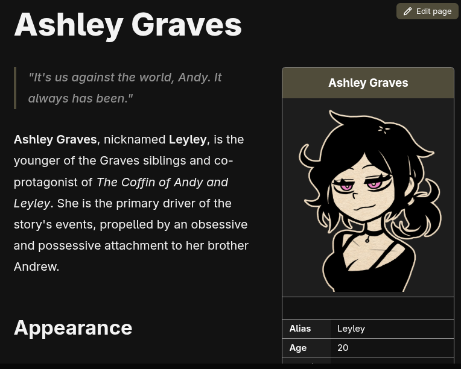

Supported formatting:

- Standard GFM: tables, code blocks, lists, blockquotes, horizontal rules
- GitHub-style alerts (`> [!NOTE]`, `> [!TIP]`, `> [!IMPORTANT]`, `> [!WARNING]`, `> [!CAUTION]`) with colored borders and icons
- Raw HTML for custom layouts (floating infoboxes, multi-column grids, inline styles)
- Echo links resolved as inline images and audio players
- [Composition blocks](#composition-blocks): cards, stat-table infoboxes, layered scenes, and frame-by-frame or moving-sprite animations built from game assets
- Anchor links scrolling to the target heading within the page
- External links opening in the browser

Navigation uses a breadcrumb bar that slides down from the top when hovering the Wiki tab. Each segment in the breadcrumb has a dropdown showing sibling pages at that level.

For more details, [watch the demo video](https://youtu.be/8LDJ3MG-C0I "EchoWiki features demo video")

### Live Editor

Moderators can edit wiki pages directly inside the app. An edit button appears in the top-right corner of the wiki view when in expanded mode. Clicking it opens the editor, where the Markdown source sits next to a live preview that updates as you type.

An **Insert** toolbar above the editor builds the trickier syntax for you: dialogs for inserting an asset image (with an asset picker), an infobox, a layered scene, a frame-by-frame or moving animation, and `:::def` path aliases, plus quick buttons for centered text, bold, italic, inline code, and a table template.

Saving requires a short description of the change (at least 10 characters). When collaborative mode and voting are both enabled, the save dialog shows a "Bypass public vote" checkbox, unchecked by default: leaving it unchecked sends the edit through the suggestion and voting flow, while checking it writes straight to the wiki without a vote post.

When saving directly, the reason is prefixed with the moderator's username and stored in the Reddit wiki revision history. Navigating away while editing prompts for confirmation before discarding changes.

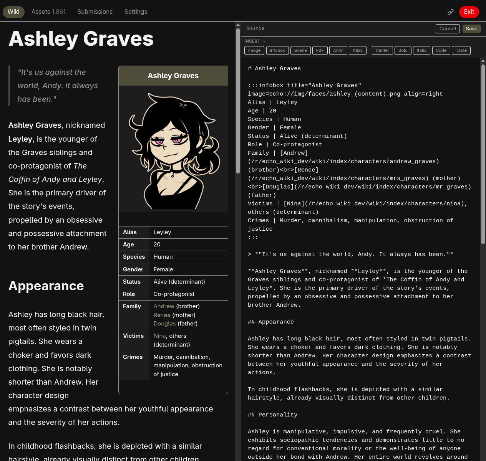

### Section Links

Every heading has a copy-link button that appears on hover. Clicking it copies an `echolink://` URL pointing to that specific section. These links can be shared with other users of the same subreddit's EchoWiki. To open one, use the link icon in the top bar to open the EchoLink dialog, then paste the URL. The dialog also accepts `echo://` asset paths to jump directly to a file in the asset browser.

## Collaborative Editing

When collaborative mode is enabled, users who meet the subreddit's eligibility thresholds (karma and account age, both configurable) can suggest changes to any wiki page. Each user can have one active suggestion at a time.

### Suggestions

Suggesting a change opens the same editor as the mod editor, with three ways to preview your work:

- **Normal**: live rendered Markdown of the suggested content
- **Source**: the raw Markdown of the suggestion
- **Diff**: a side-by-side comparison of the current page and the suggestion, with changed text highlighted character by character (removed in red, added in green) and unchanged stretches collapsed

Submitting requires a description of what changed (at least 10 characters). The suggestion is then queued for mod review or community voting, depending on configuration.

A user can update their pending suggestion from the Submissions tab. Each update resets any votes already cast on the suggestion. The maximum number of updates and the minimum time between updates are both configurable in mod settings.

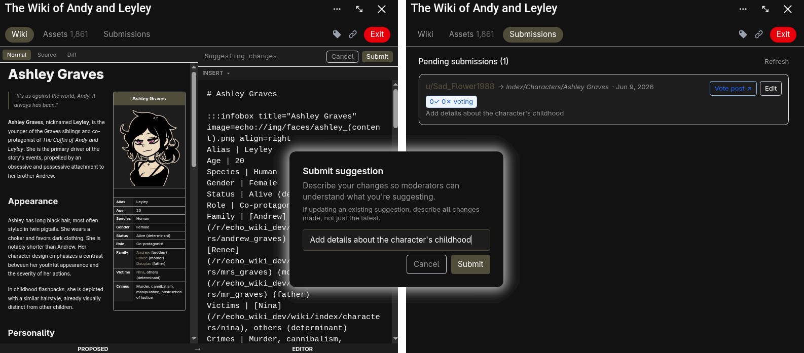

### Voting

When voting is enabled, submitting a suggestion creates a separate Reddit post where community members cast votes. The voting post embeds the same side-by-side comparison as the editor (Normal / Source / Diff modes) so voters can review exactly what is changing, then vote **✓ FOR** or **✗ AGAINST**; clicking the chosen side again retracts the vote. Running tallies, the thresholds, and the time remaining are shown along the top.

A suggestion is finalized automatically when any of the following conditions are met:

- The accept vote count reaches the configured threshold
- The reject vote count reaches the configured threshold
- The voting deadline passes and the percentage of accept votes meets the configured time-based threshold

A minimum number of voters can be required before the time-based threshold applies. The suggestion author cannot vote on their own suggestion. Voter eligibility (karma and account age) is configurable separately from contributor eligibility.

The voting post includes a pinned bot comment that records vote events: when the vote opened, when the suggestion was updated, and when the vote concluded with the outcome and reason. The comment is updated as events occur, and the post is locked once the vote concludes.

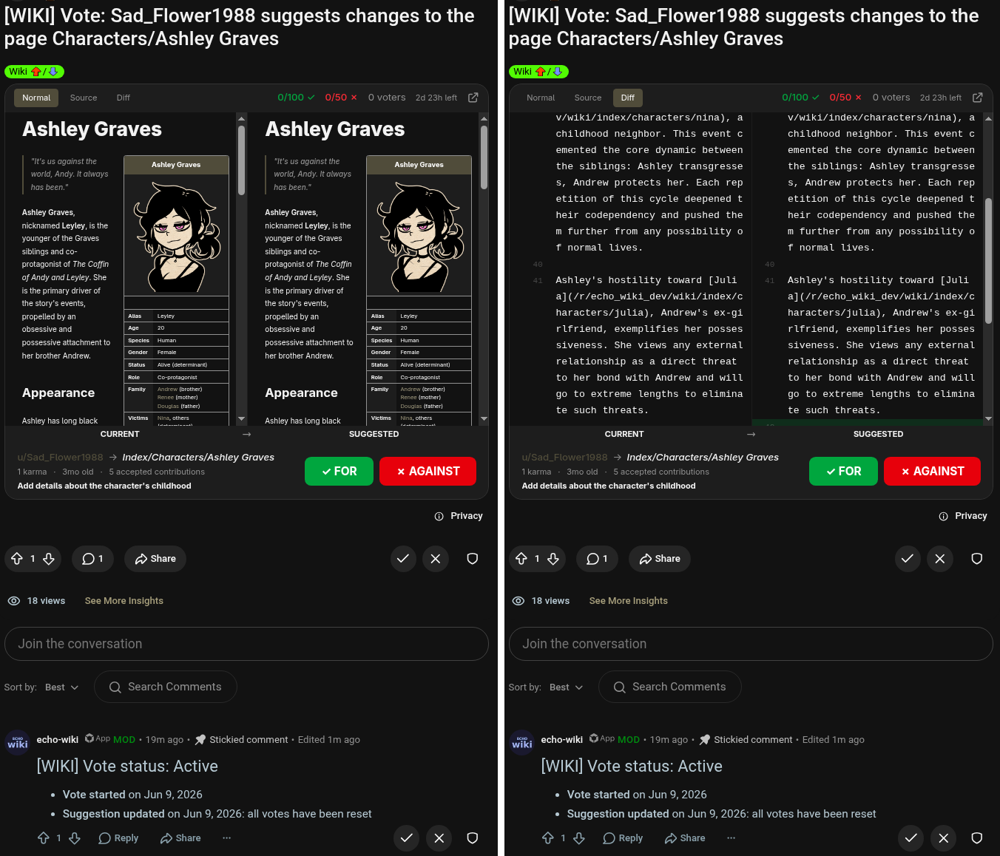

### Mod Review

Moderators with "wiki" or "config" permissions see a Submissions tab listing all pending suggestions, each with the contributor, target page, description, and vote status if voting is enabled. Clicking Review opens a full-screen modal comparing the current page (left) and the suggestion (right), with the same Normal / Source / Diff modes as the editor; either column can be collapsed by clicking its label.

Mods can Accept or Deny from the review modal, or Deny a suggestion straight from the list, at any time and regardless of the vote result. When a voting post exists, a link to it is shown. Accepting writes the suggested content to the Reddit wiki with the contributor's username in the revision reason.

Contributors also see the Submissions tab, where they can edit their own pending suggestion's content and description. A suggestion can be withdrawn entirely from the suggest dialog (which offers to delete the current one when you start another).

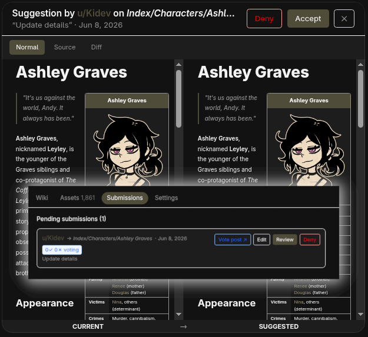

### Flair Rewards

Mods can configure two flair templates in the Collaborative settings: one for contributors and one for advanced contributors (awarded after a configurable number of accepted suggestions). When a suggestion is accepted, the contributor earns the appropriate flair based on their acceptance count.

Flairs are not assigned automatically. Users choose when to equip them using a dropdown in the top bar, to the left of the EchoLink button. The dropdown lists all earned flairs with their styled previews. Users can switch between earned flairs at any time or remove their flair.

## Echo Links

Echo links are standard Markdown image or link syntax using the `echo://` scheme:

```markdown

[Battle theme](echo://audio/bgm/battle.ogg)
```

Users who have imported their copy of the game see assets resolved inline. Everyone else, including those reading the raw wiki on Reddit, sees only the alt text. Nothing is uploaded to any server.

### Asset Editions

Echo links support edition parameters that transform how assets are displayed, using URL query-parameter syntax appended to the path. Editions are applied client-side in real-time.

| Edition    | Syntax                    | Description                                             |
| ---------- | ------------------------- | ------------------------------------------------------- |
| **Crop**   | `?crop`                   | Trims transparent pixels from all edges of the image    |
| **Sprite** | `?sprite=cols,rows,index` | Extracts a single cell from a sprite sheet grid         |
| **Speed**  | `?speed=value`            | Sets audio playback speed (0.25 to 4.0, default 1.0)    |
| **Pitch**  | `?pitch=value`            | Shifts audio pitch in semitones (-12 to +12, default 0) |

Editions combine with `&`:

```markdown

[Battle theme fast](echo://audio/bgm/battle.ogg?speed=2.0&pitch=-3)
```

The asset preview lightbox includes interactive controls for applying editions. The generated echo link (copied via the copy button) includes the active edition suffixes.

### Composition Blocks

Wiki pages support a set of fenced block directives for building richer layouts and animations without writing raw HTML. Each block opens with `:::type [params]` and closes with `:::`. Parameter values containing spaces must be quoted: `key="some value"`.

**`:::card`** floats a portrait image to one side with any markdown content (headings, tables, text) flowing alongside it.

```
:::card image=echo://img/faces/hero.png size=120px align=right
## Character Name
Description and stats here.
:::
```

**`:::infobox`** renders a classic stat-table infobox: an optional title header and image on top of a list of `Label | value` rows, floated to one side of the page.

```
:::infobox title="Character Name" image=echo://img/faces/hero.png align=right
Class | Hero
HP | 9999
Weapon | Echo Blade
:::
```

**`:::scene`** stacks images at absolute positions inside a fixed-size container. `bg:` is the background layer, `layer:` places a sprite at custom CSS coordinates (append `bottom=`, `left=`, `height=`, etc.), and `fg:` is a foreground overlay with `pointer-events: none`.

**`:::fbf`** (frame by frame) cycles through sprite frames using CSS opacity animation. List one `echo://` path per line. Use `fps` to set playback speed, `size` for the box pixel dimensions, and `alias=name` to name the block for use in `:::anim`.

**`:::anim`** moves a sprite across a background scene. Reference an `:::fbf` block via `ref=alias`, or supply frames inline. Define the movement path as one or more keyframe lines (`N% key=value ...`).

| Param              | Default | Description                                                                                                                                                                                                               |
| ------------------ | ------- | ------------------------------------------------------------------------------------------------------------------------------------------------------------------------------------------------------------------------- |
| `ref`              |         | Alias of an `:::fbf` block to use as the sprite                                                                                                                                                                           |
| `fps`              | `2.5`   | Frames per second. Treated as a target: see `hold`. Ignored when `ref` is set                                                                                                                                             |
| `spritesize`       | natural | Sprite size: a pixel value (e.g. `48`) fixes the size; omit it (or use a `%`) to render the sprite at its natural size. Ignored when `ref` is set                                                                         |
| `loops`            | `1`     | Number of whole walk cycles per movement; movement time is derived as `loops × frames ÷ fps`. Ignored when `duration` is set                                                                                              |
| `duration`         | `3s`    | Explicit time for one full movement. Overrides `loops`                                                                                                                                                                    |
| `hold`             | `true`  | Locks the walk to the movement: the cycle is snapped so a whole number of cycles exactly fills the movement, so the sprite never switches direction mid-stride. `hold=false` keeps the raw `fps` and lets the cycle drift |
| `pingpong`         | `false` | `true` reverses direction at the end of each cycle instead of jumping back to start (sprite does not flip)                                                                                                                |
| `width` / `height` | `50%`   | Scene container size (use `%` height with a background)                                                                                                                                                                   |
| `bg` / `bgopacity` |         | Background image path and opacity (`0`-`1`)                                                                                                                                                                               |

```
:::fbf alias=hero fps=11 size=48
echo://img/characters/actor.png?sprite=12,8,0
echo://img/characters/actor.png?sprite=12,8,1
echo://img/characters/actor.png?sprite=12,8,2
echo://img/characters/actor.png?sprite=12,8,1
:::

:::anim ref=hero loops=3 width=60% height=120px pingpong=true bg=echo://img/parallaxes/bg.png bgopacity=0.6
0% left=8px bottom=24px
100% left="calc(100% - 56px)" bottom=24px
:::
```

**Multi-phase animations** swap the sprite mid-loop: add `---` separators inside `:::anim`, each with its own frames and movement keyframes (and optional `fps`, `spritesize`, `loops`, `duration`, `hold`). They composite into one seamless loop: e.g. a right-facing walk left-to-right, then a left-facing walk back: so the character always faces the way it is walking.

```
:::anim width=75% height=50% bg=echo://img/parallaxes/bg.png?crop bgopacity=1
--- fps=6 spritesize=100% loops=3
echo://img/characters/actor.png?sprite=12,8,24
echo://img/characters/actor.png?sprite=12,8,25
echo://img/characters/actor.png?sprite=12,8,26
echo://img/characters/actor.png?sprite=12,8,25
0% left=10% bottom=5%
100% left=60% bottom=5%
--- fps=6 spritesize=100% loops=3
echo://img/characters/actor.png?sprite=12,8,12
echo://img/characters/actor.png?sprite=12,8,13
echo://img/characters/actor.png?sprite=12,8,14
echo://img/characters/actor.png?sprite=12,8,13
0% left=60% bottom=5%
100% left=10% bottom=5%
:::
```

**`:::def`** defines reusable aliases for long echo paths. List `name = echo://path` lines inside the block, then reference them anywhere on the page as `echo://~name`.

```
:::def
hero = echo://img/characters/actor1.png
theme = echo://audio/bgm/battle.ogg
:::


```

Content can also be centered with `>>>content<<<`, which wraps anything between the markers in a centered div.

Inline echo images accept two display hints appended like editions: `?emoji` shrinks the image to the height of the surrounding text so it reads as an inline icon, and `?outline` draws a dashed accent-colored outline around it. They combine with editions and with each other.

The file `features-new.md` in the repository is a full showcase of all these features with live examples.

## Asset Import

Users select their game folder. The app auto-detects the engine, extracts assets entirely in the browser, and stores them in IndexedDB. Nothing is uploaded.

### Supported Engines

Engine detection is automatic. RPG Maker games are decrypted natively, including their archive formats:

| Engine               | Format            |
| -------------------- | ----------------- |
| **RPG Maker 2003**   | XYZ image format  |
| **RPG Maker XP**     | RGSSAD v1 archive |
| **RPG Maker VX**     | RGSSAD v1 archive |
| **RPG Maker VX Ace** | RGSS3A v3 archive |
| **RPG Maker MV**     | Individual files  |
| **RPG Maker MZ**     | Individual files  |
| **TCOAAL 3.0+**      | Individual files  |

Beyond RPG Maker, most other games work too. When no known engine is matched, EchoWiki falls back to a generic scan that picks up image and audio files from anywhere in the folder, using each file's parent folder as its category. Along the way it automatically unpacks common archives: RenPy `.rpa`, `.zip`, and `.nw` packages, so Godot, GameMaker, and RenPy titles are supported out of the box.

For anything unusual, mods can supply a custom transform: a short snippet of JavaScript that receives each file and returns the decoded asset. This lets a community add support for an engine EchoWiki doesn't recognize on its own.

## Asset Browser

A gallery view with filter tabs (Images, Audio) and subfolder navigation. Each card has a copy button that copies its echo Markdown to the clipboard (Ctrl/Cmd+click copies the link with the original, unmapped filename instead). When a filename mapping is configured, cards display their mapped names. A "Load more" button pages in additional assets on demand.

Clicking any asset opens a full preview: an image lightbox, or an audio player with a waveform you can click to seek. The lightbox carries interactive [edition](#asset-editions) controls (crop, sprite-cell picker, audio speed and pitch); the copy button there bakes the active editions into the link, and right-clicking the preview copies it directly.

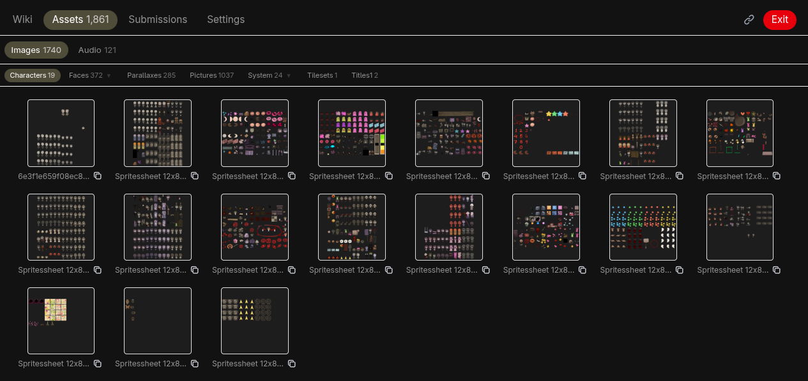

## Mod Settings

The Settings tab is visible only to moderators with the "config" permission (or full moderators with no permission restrictions). Moderators with only "wiki" permission can access the Submissions tab and edit wiki pages directly, but not the Settings tab.

### General

- **Wiki Title**: Displayed on the home screen below the logo. Leave empty for default.
- **Wiki Description**: Short text shown below the title.

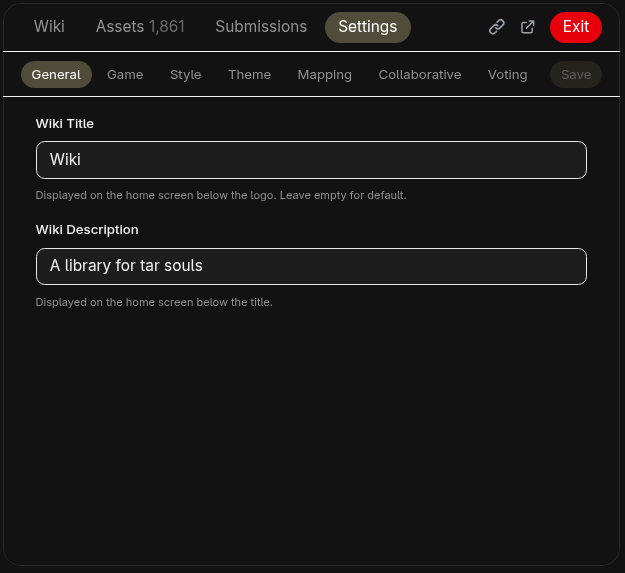

### Game

- **Game Title**: Displayed to users during import. A warning appears if the detected title does not match.
- **Engine**: Leave on Auto-detect, or force a specific engine (the RPG Maker family, Generic, TCOAAL, or Custom transform).
- **Encryption Key**: Override the decryption key for games with encrypted assets. Leave empty for auto-detection. Not used by Generic or TCOAAL.
- **Custom Transform Code**: Shown when the engine is set to Custom. A JavaScript snippet, run in each reader's browser, that receives every game file and returns the decoded asset (or skips it), letting mods support formats EchoWiki doesn't handle natively. A warning notes that it runs in users' browsers, so only set it from a trusted source.

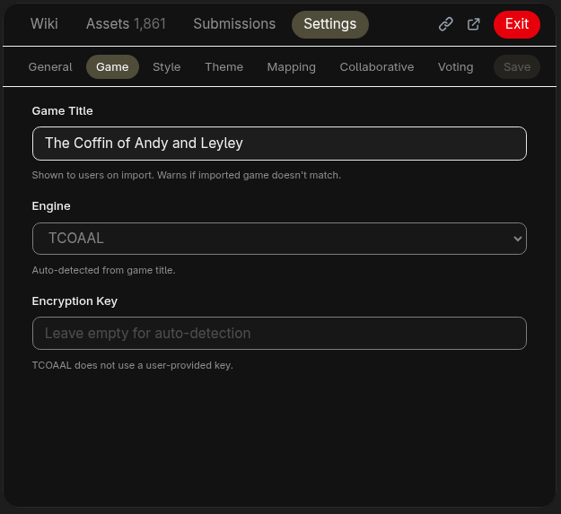

### Style

- **Card Size**: Compact, Normal, or Large thumbnails in the asset browser.
- **Wiki Font Size**: Small, Normal, or Large.
- **Font**: System, Serif, Mono, or Subreddit (uses the subreddit's configured font).
- **Home Background**: Ripple animation, subreddit banner, both, or none.
- **Home Logo**: EchoWiki logo or subreddit icon.

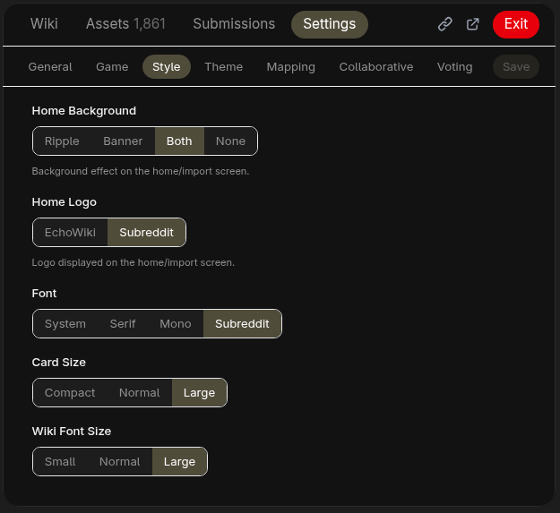

### Theme

Separate light and dark mode configuration. Each color has a reset button to restore the default derived from the subreddit's appearance settings. The app follows the user's system light/dark preference.

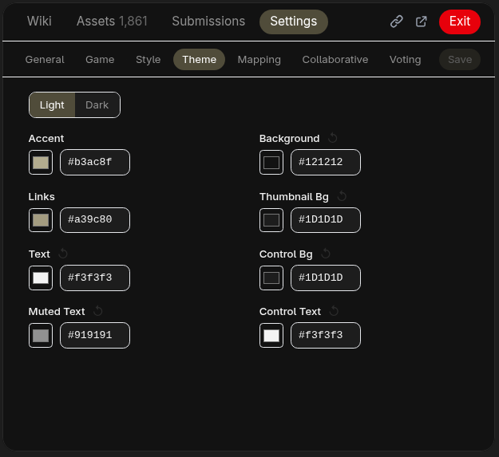

### Mapping

Mods define `"original": "mapped"` pairs (one per line, comments supported), with a live preview table showing how each pair is parsed (Original / Mapped To). Mapped names replace raw filenames in the asset browser and in echo links.

When a mapping is changed or removed, any wiki echo links referencing the old mapped name are automatically replaced with the original filename. A notification shows how many replacements were made and which pages were updated.

Example:

```
// Character sprites
"actor1": "hero"
"actor2": "villain"

// Tilesets
"dungeon_a1": "cave_floor"
```

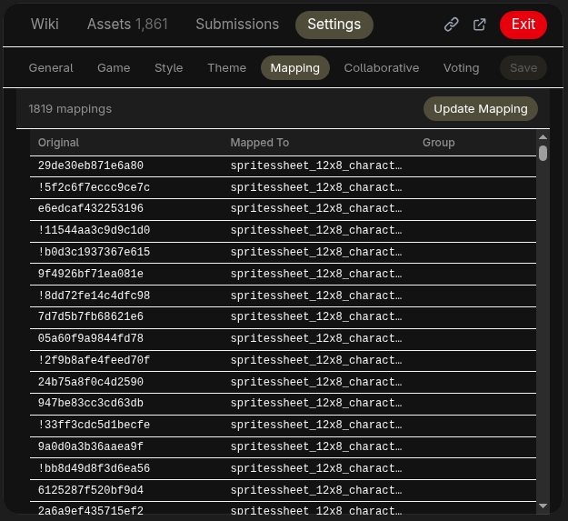

### Collaborative

- **Collaborative mode**: Toggle to enable or disable community suggestions.
- **Eligibility thresholds**: Minimum karma and account age required to submit suggestions.
- **Edit cooldown**: Minimum number of minutes a user must wait between edits to their pending suggestion.
- **Contributor flair**: Flair template awarded to users after their first accepted suggestion.
- **Advanced contributor flair**: Flair template and acceptance count threshold for the advanced tier.
- **Banned contributors**: List of users banned from submitting suggestions.

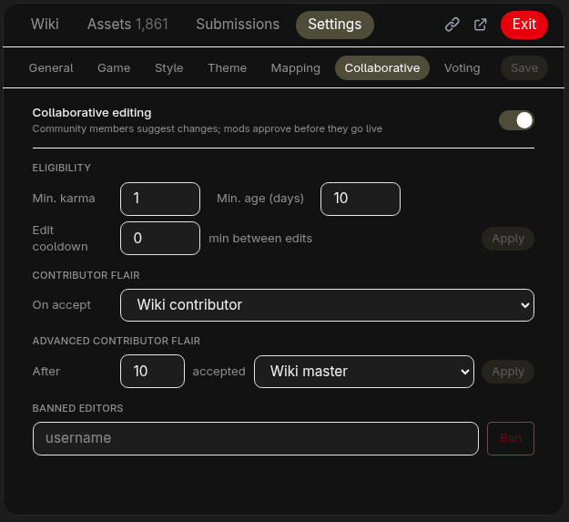

### Voting

- **Voting**: Toggle to enable or disable community voting on suggestions (requires collaborative mode).
- **Accept threshold**: Number of accept votes that approve a suggestion immediately. 0 disables the instant accept.
- **Reject threshold**: Number of reject votes that reject a suggestion immediately. 0 disables the instant reject.
- **Duration**: Voting period in days. Set to 0 to disable deadline-based finalization.
- **Minimum voters for timing**: Number of voters required before the time-based threshold applies.
- **Time-based threshold**: Percentage of accept votes required to pass when the deadline is reached. 0 means a simple majority wins.
- **Allow vote changes**: Whether voters can change their vote after casting, with an optional cooldown between changes.
- **Show voter names**: Whether voter names are visible to other users. Mods and the suggestion author always see names.
- **Max suggestion updates**: Maximum number of times a pending suggestion can be updated (0 for unlimited).
- **Voter eligibility**: Minimum karma and account age required to vote (separate from contributor eligibility).
- **Voting post flair**: Flair template applied to voting posts on creation.
- **Voting post title**: Template for the title of created voting posts. Supports `%user%`, `%page%`, `%pathPage%`, and `%shortPathPage%` placeholders.

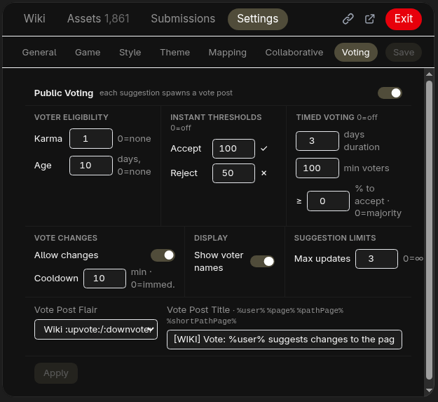

## A Note to Game Developers

Fan wikis happen. For any game with a dedicated community, players will build wikis filled with screenshots, ripped sprites, and re-hosted audio. Assets end up scattered across third-party sites, reposted without context, and stripped of any connection to the original product.

EchoWiki takes a different approach. No asset is ever uploaded, hosted, or distributed by anyone. Each user loads files from their own purchased copy of the game, and those files never leave their machine. The wiki references assets by filename, but every reader must own and import the game themselves for anything to appear. There is no server hosting the art, no CDN serving the music, no download link anywhere. If someone does not own the game, they see nothing. The app encourages ownership rather than working around it.

## Privacy

All game files are processed locally in the browser using IndexedDB. No assets are uploaded anywhere. Server-side storage (Redis) holds only mod configuration (game title, style settings, filename mappings, collaborative and voting settings) plus the text of pending suggestions and vote records. See [PRIVACY_POLICY.md](https://raw.githubusercontent.com/Kidev/EchoWiki/refs/heads/main/PRIVACY_POLICY.md) and [TERMS_AND_CONDITIONS.md](https://raw.githubusercontent.com/Kidev/EchoWiki/refs/heads/main/TERMS_AND_CONDITIONS.md).
